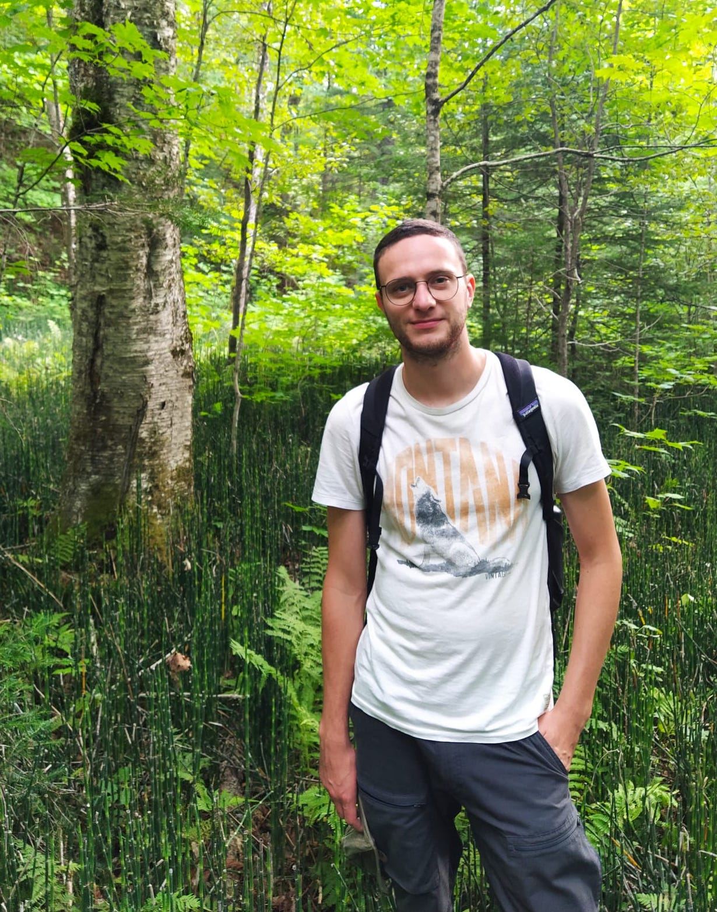
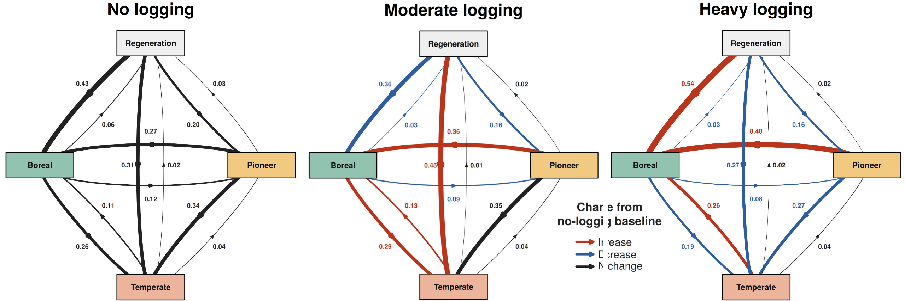
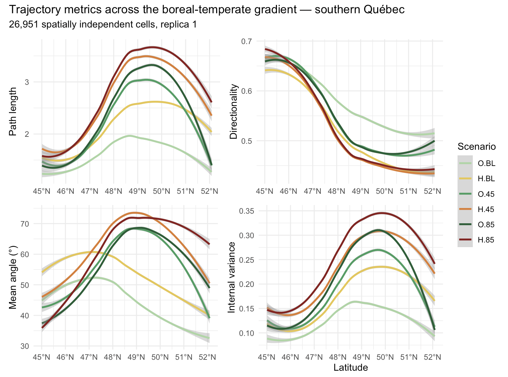
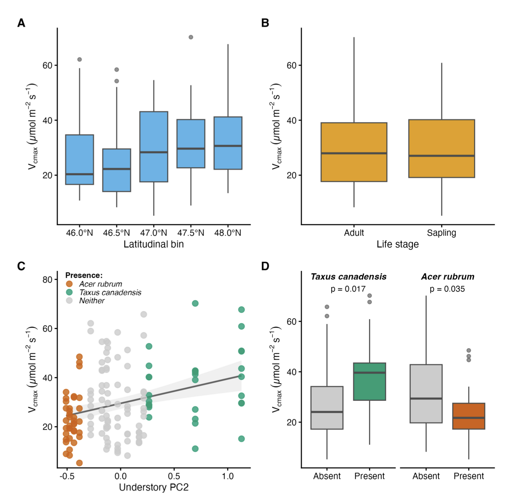

::: {.hero-title}
Hi, I'm Lukas!
:::

::: {.intro-block}
::: {.intro-flex}
::: {.intro-text}
I study how climate change, disturbances, and their interactions shape the distribution of tree species in Quebec, Canada. To look at these processes across different spatial and timescales, I combine field work, large-scale forest inventory data, and spatially explicit model projections.

Currently, I'm a PhD candidate in the [Forest Ecology lab](https://mhbrice.github.io/en/) at the University of Montreal, a [BIOS2](https://bios2.usherbrooke.ca/) fellow, and a member of the [Centre for Forest Research](https://www.cef-cfr.ca/). I expect to defend early 2027 and am starting to look ahead to what comes next.

My research interests center on climate driven range dynamics and ecological forecasting at large spatial scales. I'm increasingly interested in what future forest changes mean for the species that depend on them, and how we might bring that into future projections at different scales.

Feel free to reach out: [lukas.van.riel@umontreal.ca](mailto:lukas.van.riel@umontreal.ca)
:::

::: {.intro-photo}

:::
:::
:::

## My research

Across three chapters, my thesis asks how Quebec's forests respond to climate change. I look at what other factors, like natural and anthropogenic disturbance regimes, shape that response at scales ranging from individual trees to entire landscapes.

::: {.chapter-row}
::: {.chapter-text}
### Forest succession under a changing climate

**Goal.** Understand how forest succession in Quebec has already responded to climate change, and how covariates like soil conditions and disturbance regimes shaped that succession.

**Method.** A Bayesian multistate survival model fitted across ~12,500 permanent forest plots across Quebec, to estimate transition rates and probabilities between forest states over time.

Natural disturbances seem to have a neutral effect on the ongoing thermophilization. Meanwhile, anthropogenic disturbances (harvest) matter a lot more, with harvest intensity determining whether stands shifted toward warmer-adapted species or resisted a compositional shift. Soil also acts as a filter, screening out certain temperate specialist species regardless of disturbance, suggesting that facilitation may be needed before a full switch to temperate forest composition can occur.

:::

::: {.chapter-image}

:::
:::

::: {.chapter-row .reverse}
::: {.chapter-text}
### Forest resilience under different future scenarios

**Goal.** Assess the future resilience of forest stands under different climate and disturbance scenarios until 2150.

**Method.** Ecological Trajectory Analysis (De Cáceres et al., 2019) applied to landscape simulations run with LANDIS-II, a spatially explicit forest landscape model, in collaboration with Natural Resources Canada.

:::

::: {.chapter-image}

:::
:::

::: {.chapter-row}
::: {.chapter-text}
### Yellow birch under climate stress

**Goal.** Understand what currently limits the temperate species yellow birch (*Betula alleghaniensis*) at the northern edge of its range. Is it climate directly, or something else? 

**Method.** Dendrochronological and ecophysiological measurements (photosynthetic capacity, growth) along a latitudinal gradient spanning the species' range boundary for both adult and juvenile trees.

Contrary to the macroclimate hypothesis, site quality turned out to drive photosynthetic capacity and growth more than climate itself. We believe this site quality to be a proxy for the stand disturbance history, which would imply that disturbances contribute to the stability of the boreal zone in Quebec. 
:::

::: {.chapter-image}

:::
:::

---

## Publications

**Van Riel, L.**, Brice, M.-H., Bouchard, M., Girard, F. (under review). Local factors, not macroclimate, drive tree carbon supply and allocation at a temperate range boundary. *Forest Ecology and Management.*

Hébert, K., Earley, N., Reynolds, J., Srivastava, D., Starzomski, B., Tseng, M., Larocque, G., Pagé, J., Raudsepp-Hearne, C., Soroye, P., Emry, S., Hunt, D., Rogy, P., Brabant, C., Deedes-Vincke, S., Díaz-Corzo, M.C., Eckert, L., Eckhardt, K., Elwell, S., Kester, N., Lee, J., Morrison, S., Olu-Ayorinde, E., Trottier, L., **Van Riel, L.**, Yunusov, S., Eckert, I., Serrano, J., Wightman, N., Horikawa, M., Hull, R., Nagpal, L., Drapeau Picard, A.-P., Lacroix-Carignan, É., Duplessis, D., Léveillé-Bourret, É., Poulin, M.-A., Zerafa, A., Pollock, L. (under review). Blitz the Gap: a nation-wide effort to guide citizen science toward the needs of biodiversity science. *FACETS.*

Lévesque, C., Hébert, K., Lebeuf-Taylor, I., Sepúlveda-Correa, A., **Van Riel, L.**, Feyten, L., Stahl, A., Ménard, K., Pereira Braga, P.H., Pham, J., Charette, C., Zhang, W., Edwards, B., King, L. (under review). Leveling up multispecies models: using Hierarchical Generalized Additive Models to estimate variation in spatial and temporal trends across species. *Methods in Ecology and Evolution.*

---

## Contact

Email: [lukas.van.riel@umontreal.ca](mailto:lukas.van.riel@umontreal.ca)